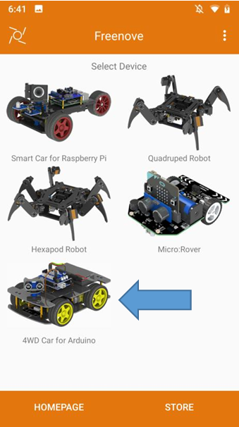
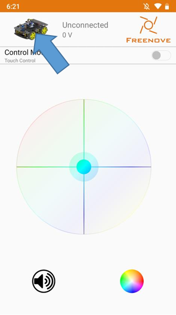
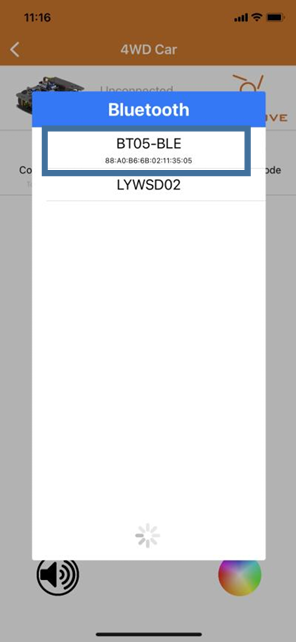

# Hướng dẫn sử dụng Freenove 4WD Car Kit

> [!WARNING]
> Hướng dẫn này chỉ tập trung chủ yếu vào technical guidance!

## Các yêu cầu cần thiết
- Windows 10 trở lên, MacOS từ 10.15 trở lên, nếu bạn dùng Linux thì còn phụ thuộc vào distro bạn đang dùng nữa. Ưu tiên sẽ là Ubuntu 20.04+/Debian 11. 

- Arduino IDE, có thể tải tại [đây cho các hệ điều hành](https://github.com/arduino/arduino-ide/releases/tag/2.3.6). 

- Với Macbook sử dụng series Apple M, tải bản `*arm64`, với series sử dụng CPU Intel, tải bản `*64bit`.

- Biết cách sử dụng Arduino cơ bản, và cách debug lỗi, upload code lên Arduino bằng IDE.

- Drivers. Cài driver bằng cách vào thư mục `Drivers` ở repo vừa clone về, và chạy trình cài đặt với hệ điều hành tương ứng. 

- Có thể dùng PlatformIO để thay thế nếu bạn thuộc hạng người dùng chuyên nghiệp. Hướng dẫn dưới đây sẽ chỉ tập trung vào Arduino IDE.

> [!WARNING]
> Nếu một trong những yêu cầu ở đây không đạt, thì quá trình cài đặt hoặc chạy sẽ có thể bị lỗi hoặc không hoạt động như mong muốn!

> [!WARNING]
> Trước khi nạp bất cứ thứ gì vào chiếc xe, hãy nhớ rút module Bluetooth và IR ra ngoài! Sau khi nạp xong thì có thể lắp lại module Bluetooth và IR để sử dụng xe với remote.

## Cài đặt các thư viện cần thiết
Để cài đặt các thư viện, hãy mở Arduino IDE lên.

<p align="center">
    
</p>

### Các bước thực hiện
- Chọn **Sketch**
- Chọn **Include Library**
- Chọn **Add .ZIP Library...**

Sau đó thì một cửa sổ Explorer sẽ hiện ra, mở thư mục của repo và chọn vào thư mục `Libraries`.

<p align="center">
    
</p>

Chọn vào từng thư viện một và chọn Open để cài đặt thư viện.

Vì Arduino IDE không hỗ trợ cài nhiều thư viện cùng lúc, nên chúng ta phải cài đặt thư viện thủ công. Lặp lại các bước trên cho đến khi cài hết tất cả các thư viện có trong thư mục.

## Quick start guide

## Chương 0. Lắp ráp Robot
Mở [Tutorial.pdf](https://github.com/rcs-staging/Freenove/blob/master/Tutorial.pdf) và nhìn vào trang 21 đến trang 31.

## Chương 1. Điều khiển motor

Bạn có thể tham khảo các code dưới đây của Freenove để test qua các chức năng của chiếc xe xem xe đó có hoạt động ổn không. Các code ở bên dưới chỉ nên sử dụng với mục đích kiểm tra (diagnostics) nếu phát hiện có sự bất thường trong chiếc xe, hoặc có thể sử dụng để tìm hiểu sâu hơn về chiếc xe.

- [Quay motor bên trái](https://github.com/Freenove/Freenove_4WD_Car_Kit/raw/refs/heads/master/Sketches/01.1.1_RunMotor_Left_Wheel/01.1.1_RunMotor_Left_Wheel.ino)
- [Quay motor bên phải](https://github.com/Freenove/Freenove_4WD_Car_Kit/raw/refs/heads/master/Sketches/01.1.2_RunMotor_Right_Wheel/01.1.2_RunMotor_Right_Wheel.ino)
- [Di chuyển xe (tiến/lùi/trái/phải)](https://github.com/Freenove/Freenove_4WD_Car_Kit/raw/refs/heads/master/Sketches/01.1.3_Car_Move_and_Turn/01.1.3_Car_Move_and_Turn.ino)
- [Buzzer (còi)](https://github.com/Freenove/Freenove_4WD_Car_Kit/raw/refs/heads/master/Sketches/01.2.1_Buzzer/01.2.1_Buzzer.ino)
- [Lấy thông tin về pin](https://github.com/Freenove/Freenove_4WD_Car_Kit/raw/refs/heads/master/Sketches/01.2.2_Battery_level/01.2.2_Battery_level.ino)
- [Dải đèn LED](https://github.com/Freenove/Freenove_4WD_Car_Kit/raw/refs/heads/master/Sketches/01.3_Led_Strip/01.3_Led_Strip.ino)
- [Test tổng hợp](https://github.com/Freenove/Freenove_4WD_Car_Kit/raw/refs/heads/master/Sketches/01.4.1_Integrate_Functions/01.4.1_Integrate_Functions.ino)
- [Tích hợp thư viện vào trong việc test](https://github.com/Freenove/Freenove_4WD_Car_Kit/raw/refs/heads/master/Sketches/01.4.2_Library_Integrate_Functions/01.4.2_Library_Integrate_Functions.ino)

## Chương 2. Tự động né vật cản bằng Servo
Sử dụng code [này](https://github.com/Freenove/Freenove_4WD_Car_Kit/tree/master/Sketches/02.3.2_Library_Automatic_Obstacle_Avoidance) để né vật cản bằng Servo.

Mở file `02.3.2_Library_Automatic_Obstacle_Avoidance.ino` và nạp file đó bằng Arduino IDE.

Tham số có thể thay đổi trong file `Automatic_Obstacle_Avoidance_Mode.cpp`:

```cpp
pulseIn(pin, value, timeout)
```

**Chức năng:** Đọc độ dài của một xung trên chân.

- `pin`: Chân cần đọc xung.
- `value`: Kiểu xung cần đọc — HIGH hoặc LOW.
- `timeout` (tùy chọn): Thời gian chờ (microgiây) trước khi dừng đọc.

## Chương 3. Tự động dò line
Để đọc giá trị của cảm biến dò đường, sử dụng code [này](https://github.com/Freenove/Freenove_4WD_Car_Kit/tree/master/Sketches/03.1_Tracking_Sensor) và nạp vào board của chiếc xe.

Sau đó vẫn giữ kết nối với máy tính, mở Serial Monitor trong Arduino lên, chúng ta sẽ có các output như ảnh dưới.

<p align="center">
    
</p>

### Dò line tự động
Để dò line tự động, sử dụng code [này](https://github.com/Freenove/Freenove_4WD_Car_Kit/tree/master/Sketches/03.2_Automatic_Tracking_Line).

Sau khi nạp thì ngắt kết nối với máy tính, và đặt xe lên một đường line có sẵn. Bật xe lên và xe sẽ chạy theo line.

<p align="center">
    
</p>

Ngoài ra bạn có thể tham khảo code [này](https://github.com/Freenove/Freenove_4WD_Car_Kit/raw/refs/heads/master/Sketches/03.3_One_Code_Automatic_Tracking_Line/03.3_One_Code_Automatic_Tracking_Line.ino) nếu muốn code pack hết tất cả mọi thứ vào 1 file thay vì sử dụng thư viện.

## Chương 4. Điều khiển xe bằng sóng hồng ngoại (IR)
IR được sử dụng rộng rãi, đặc biệt là điều khiển từ xa.

### Thiệt lập phần cứng
Điều khiển sẽ nhìn trông giống như thế này:

<p align="center">
    
</p>

Đây là bộ tiếp nhận tín hiệu IR:

<p align="center">
    
</p>

Chúng ta sẽ lắp bộ tiếp nhận tín hiệu IR vào xe như hình dưới:

<p align="center">
    
</p>

### Kiểm tra xem điều khiển có hoạt động hay không
Đầu tiên, nạp code [này](https://github.com/Freenove/Freenove_4WD_Car_Kit/raw/refs/heads/master/Sketches/04.1_IR_Receiver/04.1_IR_Receiver.ino) vào chiếc xe.

Sau đó thì nạp code vào chiếc xe. Lưu ý rằng trước khi nạp code, nhớ tháo module IR ra.

Sau khi nạp xong, chúng ta sẽ reset lại chiếc xe, mở Serial Monitor lên, chiếu điều khiển vào chiếc xe và sau đó kiểm tra trong Serial Monitor để xem tín hiệu có nhận được hay không.

<p align="center">
    
</p>

- **Key pressing code:** chính là các nút bạn bấm trên điều khiển, mỗi nút sẽ tương ứng với 1 keycode đã được define sẵn trong code trên.

- Nếu bạn thấy các keycode lạ không nằm trong trong define, thì đó là lỗi và keycode đó không hoạt động.

### Điều khiển xe bằng IR
Sử dụng code [này](https://github.com/Freenove/Freenove_4WD_Car_Kit/tree/master/Sketches/04.2_IR_Remote_Car) để điều khiển xe bằng điều khiển IR.

<p align="center">
    
</p>

Các chức năng của các nút:

|Nút|Chức năng|
|:---|:---------|
|FF02FD|Đi thẳng|
|FF9867|Đi lùi|
|FFE01F|Rẽ trái|
|FF906F|Rẽ phải|
|FFA857|Tắt/bật còi|

Nếu bạn muốn xe có nhiều tính năng hơn, chẳng hạn như điều khiển đèn LED và làm 1 vài trò khác, có thể tham khảo code [này](https://github.com/Freenove/Freenove_4WD_Car_Kit/tree/master/Sketches/04.3_Multifunctional_IR_Remote_Car).

Đương nhiên, với code này sẽ có thêm chút tính năng mới.

|Nút|Chức năng|
|:---|:---------|
|FF02FD|Đi thẳng|
|FF9867|Đi lùi|
|FFE01F|Rẽ trái|
|FF906F|Rẽ phải|
|FFA857|Tắt/bật còi|
|Số 1 (FF30CF)|Cho đèn LED chạy ở mode 1 và sẽ có dải màu cầu vồng chạy qua đèn LED.|
|Số 2 (FF18E7)|Tăng tốc độ đổi màu của dải LED.|
|Số 3 (FF7A85)|Giảm tốc độ đổi màu của dải LED.|
|Số 4 (FF10EF)|Cho đèn LED chạy ở mode 2 và đổi màu water LED.|
|Số 5 (FF38C7)|Cho đèn LED nháy chậm hơn, tăng tốc độ đổi màu của dải LED.|
|Số 6 (FF5AA5)|Cho đèn LED nháy nhanh hơn, giảm    tốc độ đổi màu của dải LED.|

Nếu bạn không muốn sử dụng thư viện thì có thể tham khảo code [này](https://github.com/Freenove/Freenove_4WD_Car_Kit/raw/refs/heads/master/Sketches/04.4_One_Code_Multifunctional_IR_Remote_Car/04.4_One_Code_Multifunctional_IR_Remote_Car.ino).

## Chương 5. Sử dụng điều khiển RF24 để di chuyển xe

Điều khiển RF sẽ nhìn như hình dưới:

<p align="center">
    
</p>

Bộ điều khiển RF cần cấu hình bằng cách nạp code vào để hoạt động.

> [!WARNING]
> Trước khi nạp bất cứ thứ gì vào chiếc xe hoặc bộ điều khiển RF, hãy nhớ rút module Bluetooth ra ngoài! Sau khi nạp xong thì có thể lắp lại module Bluetooth để sử dụng xe và remote.

### Nạp code vào bộ điều khiển RF
Đầu tiên, mở code [này](https://github.com/Freenove/Freenove_4WD_Car_Kit/raw/refs/heads/master/Sketches/05.1_RF24_Remote_Controller/05.1_RF24_Remote_Controller.ino) trong Arduino IDE.

Kết nối điều khiển vào máy tính qua cáp USB-B to USB-A.

Sau đó nạp code vào bộ điều khiển, vậy là hoàn tất.

### Lắp bộ thu tín hiệu
Lắp như hình dưới:

<p align="center">
    
</p>

### Kiểm tra xem xe có nhận được tín hiệu hay không
Nạp code [này](https://github.com/Freenove/Freenove_4WD_Car_Kit/raw/refs/heads/master/Sketches/05.2_Receive_Data/05.2_Receive_Data.ino) vào xe trước.

Sau đó, lắp lại bộ thu tín hiệu vào xe, và mở Serial Monitor trong Arduino IDE.

<p align="center">
    
</p>

Nếu output ra được như hình dưới và các giá trị có nhảy là thành công.

Đây là mapping các nút, tương đương với các giá trị bên trên.

<p align="center">
    
</p>

Nếu LED ở vị trí bên dưới sáng đèn, thì báo hiệu là kết nối thành công, và ngược lại.

<p align="center">
    
</p>

### Điều khiển xe đa dụng
Nạp code [này](https://github.com/Freenove/Freenove_4WD_Car_Kit/tree/master/Sketches/05.4_Multifunctional_RF24_Remote_Car) để điều khiển xe đa dụng.

<p align="center">
    
</p>

Ngoài việc dùng axis để điều khiển xe, bạn có thể điều chỉnh công tắc như 1 pattern.

|S1|S2|S3|Mode num.|Chức năng|
|--|--|--|---------|---------|
|ON|ON|ON|0|Không|
|ON|ON|OFF|1|Cân bằng lại Servo|
|ON|OFF|ON|2|Không|
|ON|OFF|OFF|3|Chế độ né vật cản tự động|
|OFF|ON|ON|4|Không|
|OFF|ON|OFF|5|Dò line tự động|
|OFF|OFF|ON|6|Đổi chế độ LED|
|OFF|OFF|OFF|7|Điều khiển thủ công|

Hoặc nếu bạn cần solution 1 file, có thể nạp file [này](https://github.com/Freenove/Freenove_4WD_Car_Kit/raw/refs/heads/master/Sketches/05.5_One_Code_Multifunctional_RF24_Remote_Car/05.5_One_Code_Multifunctional_RF24_Remote_Car.ino) vào xe.

## Chương 6. Điều khiển Bluetooth

### Tải ứng dụng Freenove
- **Android**: https://play.google.com/store/apps/details?id=com.freenove.suhayl.Freenove hoặc tải trực tiếp APK tại [đây](https://github.com/Freenove/Freenove_App_for_Android/raw/master/freenove.apk)
- **iOS**: https://apps.apple.com/us/app/freenove/id1523264732

### Thiết lập phần cứng
Đầu tiên, nạp code [này](https://github.com/Freenove/Freenove_4WD_Car_Kit/raw/refs/heads/master/Sketches/06.1_Receive_Bluetooth_Data/06.1_Receive_Bluetooth_Data.ino) vào chiếc xe.

Sau đó, lắp module Bluetooth vào chiếc xe.

<p align="center">
    
</p>

> [!WARNING]
> Module Bluetooth có thể phải lắp ở chiều ngược lại.

Sau đó thì reset lại board và mở Serial Monitor trong Arduino.

<p align="center">
    
</p>

Sau đó, mở app Freenove và chọn vào model xe. Làm theo các bước dưới để kết nối với chiếc xe.

| | | |
|-|-|-|
||||

Nếu kết nối thành công, góc phía trên sẽ chuyển sang thành **Connected**.

<p align="center">
    
</p>

Thử điều khiển xe qua app (di chuyển lên xuống, đổi LED, bật buzzer) vả kiểm tra Serial Monitor, nếu ra được như hình dưới là thành công:

<p align="center">
    
</p>

Tham khảo một số code dưới đây để tìm hiểu thêm về Bluetooth:
- [Điều khiển xe bằng Bluetooth (cơ bản)](https://github.com/Freenove/Freenove_4WD_Car_Kit/tree/master/Sketches/06.2_Bluetooth_Remote_Car)
- [Điều khiển xe bằng Bluetooth (đa chức năng)](https://github.com/Freenove/Freenove_4WD_Car_Kit/tree/master/Sketches/06.3_Multifunctional_Bluetooth_Remote_Car)
- [Điều khiển xe bằng Bluetooth (1 file code duy nhất, đa chức năng)](https://github.com/Freenove/Freenove_4WD_Car_Kit/raw/refs/heads/master/Sketches/06.4_One_Code_Multifunctional_Bluetooth_Remote_Car/06.4_One_Code_Multifunctional_Bluetooth_Remote_Car.ino)

## References
- [Freenove 4WD Car Kit Tutorial](https://github.com/Freenove/Freenove_4WD_Car_Kit/blob/master/Tutorial.pdf)